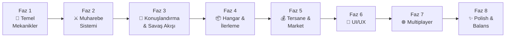
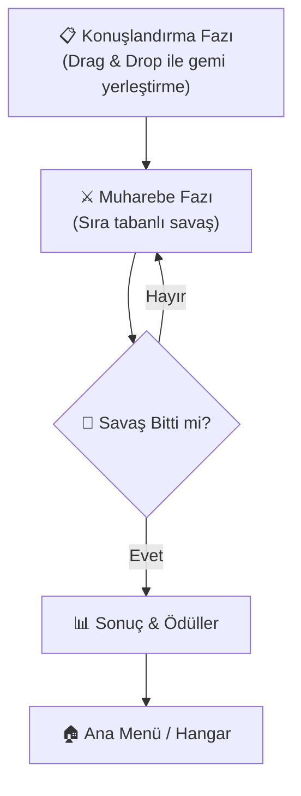
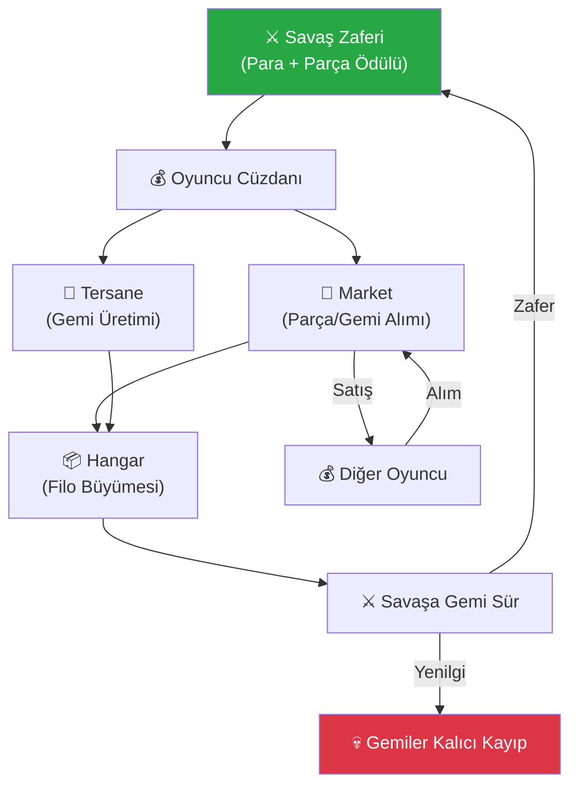
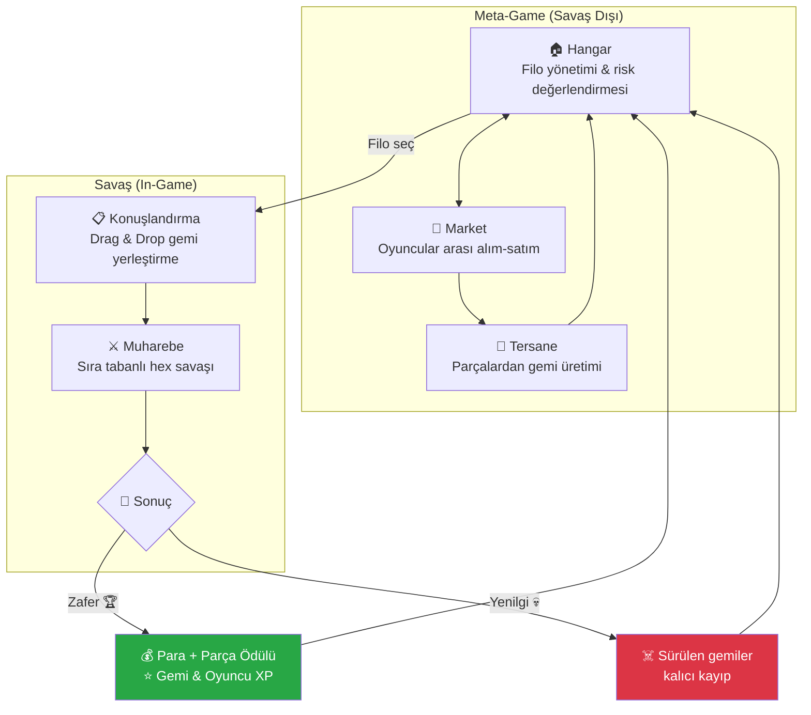

# 🗺️ Hex_Project — Multiplayer 1v1 Deniz Savaşı Strateji Yol Haritası

## Oyun Vizyonu

> Oyuncular hangarlarındaki gemileri hexagonal bir haritada karşı karşıya sürer. **Kaybeden, sahaya çıkardığı tüm gemileri kalıcı olarak yitirir.** Bu yapı her savaş kararını stratejik bir ağırlıkla yükler. Zafer para ve gemi parçası ödülü getirir; yenilgi ise geri dönüşü olmayan kayıplara yol açar. Oyun dışında Hangar, Tersane ve Market ile filo yönetimi, üretim ve oyuncular arası ekonomi döngüsü işler.

---

## Mevcut Durum Analizi

**Çalışan:**
- ✅ Hex grid sistemi (offset koordinat)
- ✅ BFS pathfinding (maliyet tabanlı)
- ✅ Glow highlight sistemi
- ✅ Raycast tabanlı seçim
- ✅ **Oyuncu sistemi** — `GameManager`, `TurnSystem`, `PlayerData` (Faz 1.1)
- ✅ **Gemi veri yapısı** — `ShipData` SO, `Ship` MonoBehaviour, `ShipManager` (Faz 1.2)
- ✅ **Sıra yönetimi** — İki oyuncu, zamanlayıcı (Inspector'dan ayarlanabilir)
- ✅ **Gemi sahipliği** — Sadece kendi gemilerini seçme, aksiyon durumu takibi
- ✅ **Otomatik bağlantı** — PlayerInput → SelectionManager → ShipManager (kod tabanlı)

**Devam eden eksikler:**
- ✅ **Başlangıç gemi tipleri** — 5 gemi tipi ScriptableObject ve prefab (Faz 1.3)
- ❌ Çoklu gemi yönetimi (birden fazla gemi spawn & kontrol) — Faz 1.4
- ❌ Kamera kontrolleri — Faz 1.5
- ❌ Savaş mekaniği (saldırı, can, hasar, kalıcı yıkım)
- ❌ Konuşlandırma fazı (Drag & Drop ile gemi yerleştirme)
- ❌ Kalıcı kayıp / kazanç sistemi
- ❌ Hangar (filo yönetimi, risk değerlendirmesi)
- ❌ Tersane (parça → gemi üretimi)
- ❌ Market (oyuncular arası alım-satım, arz-talep)
- ❌ Gemi & Oyuncu XP/ilerleme sistemi
- ❌ Ekonomi döngüsü
- ❌ Tüm UI sistemleri
- ❌ Multiplayer ağ altyapısı

---

## Faz Yapısı



---

## Faz 1 — Temel Savaş Mekanikleri 🚢
> **Hedef:** Gemilerin iki oyuncu için hex grid üzerinde hareket edebildiği sağlam bir altyapı

### 1.1 Oyuncu Sistemi ✅
| Görev | Durum | Açıklama |
|-------|-------|----------|
| `PlayerData` sınıfı | ✅ | Oyuncu kimliği, filo rengi, sahaya sürdüğü gemiler, `ResetAllShipActions()`, `AllShipsDone()` |
| `GameManager` singleton | ✅ | Oyun durumu, faz yönetimi, kazanma koşulu kontrolü |
| `TurnSystem` | ✅ | Player1 ↔ Player2 geçişi, sıra event'leri, zamanlayıcı |
| Tur zamanlayıcı | ✅ | Inspector'dan ayarlanabilir süre, süre dolunca otomatik geçiş |
| `GameEnums` | ✅ | `GamePhase`, `PlayerId`, `ShipType`, `ShipActionState` |

> **Dosyalar:** `Scripts/Core/GameManager.cs`, `TurnSystem.cs`, `PlayerData.cs`, `GameEnums.cs`

### 1.2 Gemi Veri Yapısı ✅
| Görev | Durum | Açıklama |
|-------|-------|----------|
| `ShipData` ScriptableObject | ✅ | Base HP, saldırı, menzil, hareket, icon, prefab referansı |
| `Ship` MonoBehaviour | ✅ | Sahiplik, HP/hasar, XP/seviye (max 10), aksiyon durumu, hareket coroutine'leri |
| `ShipManager` | ✅ | `UnitManager`'ın yerini aldı — sahiplik kontrolü, aksiyon kontrolü |
| `SelectionManager` güncelleme | ✅ | `Ship` referansı, C# event'leri, otomatik bağlantı |
| `MovementSystem` güncelleme | ✅ | `Ship` referansı, `ShowPath()`, `MoveShip()` |

> **Dosyalar:** `Scripts/Ship/ShipData.cs`, `Ship.cs`, `ShipManager.cs`

### 1.3 Başlangıç Gemi Tipleri ✅
| Durum | Gemi | HP | Saldırı | Saldırı Menzili | Hareket | Özellik |
|-------|------|----|---------|-----------------|---------|---------|
| ✅ | Firkateyn (Frigate) | 80 | 20 | 2 | 20 | Hızlı keşif gemisi |
| ✅ | Muhrip (Destroyer) | 120 | 30 | 2 | 15 | Dengeli savaş gemisi |
| ✅ | Kruvazör (Cruiser) | 160 | 40 | 3 | 12 | Ağır ateş gücü |
| ✅ | Zırhlı (Battleship) | 250 | 50 | 3 | 8 | Tanklar, yavaş ama dayanıklı |
| ✅ | Denizaltı (Submarine) | 60 | 45 | 1 | 18 | Yüksek hasar, düşük HP |

> [!NOTE]
> Gemi değerleri placeholder'dır. Faz 8'de dengeleme yapılacak.

### 1.4 Çoklu Gemi Yönetimi
| Görev | Açıklama |
|-------|----------|
| Gemi listeleri | Her oyuncu için `List<Ship>` — sahada aktif gemiler |
| Çoklu seçim & hareket | Bir turda birden fazla gemiyi sırayla hareket ettirebilme |
| Sadece kendi gemilerini kontrol | Oyuncu sadece kendi sırasında, kendi gemilerini seçebilir |

### 1.5 Kamera Kontrolleri
| Görev | Açıklama |
|-------|----------|
| Pan (kaydırma) | WASD / sürükleme ile harita üzerinde gezinme |
| Zoom | Scroll wheel ile yakınlaştırma/uzaklaştırma |
| Sınır kilidi | Kameranın harita dışına çıkmasını engelleme |
| Sıra geçişi animasyonu | Oyuncu değiştiğinde kamerayı ilgili tarafa geçirme |

---

## Faz 2 — Muharebe Sistemi ⚔️
> **Hedef:** Gemilerin birbirleriyle savaşabilmesi ve kalıcı olarak yok edilebilmesi

### 2.1 Sağlık & Hasar Sistemi
| Görev | Açıklama |
|-------|----------|
| `HealthSystem` component | HP, maxHP, zırh değerleri, hasar alma/iyileşme metodları |
| Hasar hesaplama | `damage = attackPower × modifier - targetArmor` (minimum 1) |
| Gemi yıkımı | HP ≤ 0 → gemi **kalıcı olarak** yok edilir, oyuncunun filosundan silinir |
| Can barı (World Space) | Gemilerin üstünde görünen 3D can barı |
| Hasar popup | Vurulan geminin üzerinde "-25" gibi kayan sayı |

### 2.2 Saldırı Mekaniği
| Görev | Açıklama |
|-------|----------|
| Saldırı menzili hesaplama | BFS benzeri, gemi tipine göre menzil |
| Saldırı highlight | Saldırılabilir düşman gemilerini kırmızı ile vurgulama |
| Karşı saldırı (Counter-attack) | Yakın mesafe saldırıda hedef gemi de karşılık verir (hasar × 0.5) |
| Saldırı animasyonu | Mermi/efekt + hasar sayısı gösterimi |

### 2.3 Gemi Aksiyonları
| Görev | Açıklama |
|-------|----------|
| Aksiyon sistemi | Her gemi turda: 1× Hareket + 1× Saldırı (veya 1× Hareket + 1× Hareket) |
| Aksiyon durumları | `Idle` → `Moved` → `Attacked` → `Done` state machine |
| Gemi durumu gösterimi | Aksiyonu biten gemiler soluk/gri gösterilir |
| Sıra bitirme | "Sırayı Bitir" butonu veya tüm gemiler `Done` olunca otomatik geçiş |

---

## Faz 3 — Konuşlandırma & Savaş Akışı 🔄
> **Hedef:** Gemilerin savaş başında Drag & Drop ile yerleştirilmesi ve savaş sonucu ile ödüllerin işlenmesi

### 3.1 Savaş Aşamaları


### 3.2 Konuşlandırma Fazı (Deployment)
| Görev | Açıklama |
|-------|----------|
| Konuşlandırma bölgeleri | Her oyuncu için haritanın kendi tarafında belirli hex'ler (spawn zone) |
| Gemi UI kartları | Her geminin image'ı olan UI kartları — sağ/sol panelde listelenir |
| Drag & Drop yerleştirme | UI kartını sürükle → haritadaki uygun hex'e bırak → gemi spawn olur |
| Yerleştirme doğrulama | Sadece kendi spawn zone'undaki boş hex'lere yerleştirebilme |
| Gemiyi geri çekme | Konuşlandırma fazı biterken gemisini geri alabilme |
| Hazır butonu | Her iki oyuncu da "Hazırım" deyince muharebe başlar |
| Konuşlandırma süre limiti | Inspector'dan ayarlanabilir (ör: 90s) |

### 3.3 Kazanma Koşulları
| Koşul | Açıklama |
|-------|----------|
| Filo imhası | Rakibin sahadaki tüm gemileri yok edilirse zafer |
| Karargah ele geçirme | Rakibin başlangıç bölgesindeki özel "Karargah" hex'i işgal edilirse zafer |

### 3.4 Savaş Sonucu İşleme
| Görev | Açıklama |
|-------|----------|
| **Zafer ödülleri** | Sabit para ödülü + düşman kayıplarından gemi yapım parçaları |
| **Yenilgi cezası** | Savaşa sürülen TÜM gemiler kalıcı olarak yok edilir |
| Hayatta kalan gemiler | XP kazanır, hangara geri döner |
| Sonuç ekranı | Kazanan, kayıplar, ödüller, XP kazanımları özet ekranı |

---

## Faz 4 — Hangar & İlerleme Sistemleri 📦
> **Hedef:** Filo yönetimi ve gemilerin/oyuncunun zamanla güçlenmesi

### 4.1 Hangar
| Görev | Açıklama |
|-------|----------|
| `Hangar` veri yapısı | Oyuncunun sahip olduğu tüm gemilerin listesi |
| Gemi envanter yönetimi | Gemileri görüntüleme, detay inceleme, savaşa seçme |
| Filo hazırlama | Savaşa çıkacak gemileri seçme ("Savaş Filosu") |
| Risk göstergesi | Seçilen filonun toplam değerini / risk seviyesini gösterme |
| Gemi detay paneli | Geminin tüm statları, seviyesi, XP'si, geçmişi |

### 4.2 Gemi İlerleme Sistemi (Ship XP)
| Görev | Açıklama |
|-------|----------|
| XP kazanma | Savaşta hayatta kalma → XP, düşman gemisi batırma → bonus XP |
| Seviye atlama | Biriken XP eşikleri: Lvl 1 → 2 (100 XP), Lvl 2 → 3 (250 XP), vb. |
| Seviye buff'ları | Her seviyede kalıcı bonus: +%5 hasar, +%5 HP, +1 hareket vb. |
| Maksimum seviye | Lvl 10 cap (deneyimli gemi = en değerli varlık) |
| Seviye göstergesi | Geminin yanında yıldız/rozet gösterimi |

### 4.3 Oyuncu İlerleme Sistemi (Player XP)
| Görev | Açıklama |
|-------|----------|
| XP kaynakları | Savaş zaferi, markette alım-satım, tersanede gemi imal etme |
| Oyuncu seviyesi | Seviye atladıkça yeni gemi tipleri, tersane tarifleri, market erişimi açılır |
| Profil & istatistikler | Toplam savaş, zafer oranı, batırılan gemi sayısı, ekonomik hacim |

---

## Faz 5 — Tersane & Market Ekonomisi 💰
> **Hedef:** Gemi üretimi ve oyuncular arası ekonomi döngüsü

### 5.1 Tersane (Shipyard)
| Görev | Açıklama |
|-------|----------|
| Gemi parçaları sistemi | `ShipPart` ScriptableObject: Gövde, Motor, Silah, Zırh, Özel Modül |
| Üretim tarifleri | Her gemi tipi için gerekli parça kombinasyonu |
| Üretim süreci | Parçaları seç → üretimi başlat → süre sonunda gemi hazır |
| Üretim süresi | Gemi tipine göre değişken (Frigate: 1 dk, Battleship: 5 dk vb.) |
| Üretim XP'si | Her üretim oyuncuya XP kazandırır |

### 5.2 Market (Marketplace)
| Görev | Açıklama |
|-------|----------|
| Satış listesi oluşturma | Gemi parçası veya hazır gemi satışa çıkarma, fiyat belirleme |
| Satın alma | Diğer oyuncuların satışlarını görüntüleme ve satın alma |
| Arz-talep mekanizması | Çok satılan ürünlerin fiyatı düşer, az bulunanların yükselir |
| İşlem geçmişi | Alım-satım logları, fiyat trendleri |
| Market XP'si | Her işlem oyuncuya XP kazandırır |

### 5.3 Ekonomi Döngüsü


> [!IMPORTANT]
> **Kapalı ekonomi:** Kaynaklar oyundan değil, oyunculardan oyunculara akar. Savaş ödülleri tek "dışarıdan para girişi" noktasıdır. Bu dengenin doğru kurulması kritik önem taşır.

---

## Faz 6 — UI/UX 🎨
> **Hedef:** Tüm sistemler için sezgisel, premium hissettiren arayüz

### 6.1 Savaş Ekranı HUD
| Element | Açıklama |
|---------|----------|
| Sıra göstergesi | Üst banner — hangi oyuncunun sırası + kalan süre (countdown) |
| Tur sayacı | "Tur 5 / ∞" göstergesi |
| Seçili gemi paneli | Gemi image'ı, isim, HP bar, saldırı, menzil, hareket, seviye |
| Aksiyon butonları | Hareket Et / Saldır / Bekle / Sırayı Bitir |
| Filo durumu | Sol/sağ kenarda her iki tarafın gemilerinin küçük ikonları + HP barları |

### 6.2 Konuşlandırma Ekranı
| Element | Açıklama |
|---------|----------|
| Gemi kartı paneli | Savaşa seçilmiş gemilerin image'lı kartları (sürüklenebilir) |
| Spawn zone vurgusu | Yerleştirilebilir hex'lerin özel renkle gösterimi |
| Drag & Drop feedback | Sürükleme sırasında gemi silüeti + geçerli/geçersiz hex göstergesi |
| Hazır butonu | "Hazırım" / "Bekleniyor..." durumları |

### 6.3 Hangar Ekranı
| Element | Açıklama |
|---------|----------|
| Gemi galerisi | Tüm gemiler grid/liste görünümü, filtreleme (tip, seviye) |
| Gemi detay kartı | Tam statlar, XP bar, seviye, savaş geçmişi |
| Filo seçimi | Savaşa sürecek gemileri seç, toplam güç göstergesi |

### 6.4 Tersane Ekranı
| Element | Açıklama |
|---------|----------|
| Parça envanteri | Sahip olunan parçaların listesi |
| Üretim tarifleri | Yapılabilir gemiler, gerekli parçalar, eksikler vurgulu |
| Üretim kuyruğu | Devam eden üretimler, kalan süre |

### 6.5 Market Ekranı
| Element | Açıklama |
|---------|----------|
| Satış listesi | Satışta olan ürünler, fiyatlar, satıcı bilgisi |
| Fiyat grafikleri | Son X gündeki fiyat değişimleri |
| Satışa çıkar | Kendi ürünlerini fiyatlandır ve listele |
| İşlem geçmişi | Son alım-satımlar |

### 6.6 Menüler
| Element | Açıklama |
|---------|----------|
| Ana menü | Savaş Bul, Hangar, Tersane, Market, Profil, Ayarlar |
| Oyuncu profili | Seviye, XP bar, istatistikler, başarımlar |
| Ayarlar | Ses, grafik, kontrol ayarları |
| Sonuç ekranı | Kazanan, kayıplar, ödüller, XP kazanımları |

---

## Faz 7 — Multiplayer 🌐
> **Hedef:** İki oyuncunun ağ üzerinden oynayabilmesi

> [!WARNING]
> Bu faz en karmaşık kısımdır. Tüm önceki fazlar tamamlanmadan başlanmamalıdır. Networking çözümü seçimi kritik bir karar noktasıdır.

### 7.1 Ağ Altyapısı Seçenekleri

| Seçenek | Artıları | Eksileri |
|---------|----------|---------|
| **Unity Netcode for GameObjects** | Resmi çözüm, iyi entegrasyon | Öğrenme eğrisi, relay sunucu gerekli |
| **Photon PUN 2 / Fusion** | Kolay kurulum, cloud sunucu | Ücretsiz limit var (20 CCU) |
| **Mirror** | Açık kaynak, olgun | Self-hosted sunucu gerekli |
| **Custom WebSocket** | Tam kontrol | Çok fazla geliştirme eforu |

> [!IMPORTANT]
> **Sıra tabanlı oyun** olduğu için yüksek performanslı tick-rate'e gerek yok. **Photon** veya **Netcode for GameObjects** en uygun seçenekler olacaktır. Hangisini tercih ettiğinizi belirtmeniz önemli.

### 7.2 Multiplayer Görevleri
| Görev | Açıklama |
|-------|----------|
| Lobi sistemi | Oda oluşturma, katılma, bekleme |
| Oyun durumu senkronizasyonu | Hex grid, gemi pozisyonları, HP değerleri |
| Sıra senkronizasyonu | Sıra geçişi, zaman aşımı (tur süresi limiti) |
| Komut tabanlı mimari | Oyuncu aksiyonlarını komut olarak gönder → sunucu doğrula → uygula |
| Bağlantı kopma yönetimi | Reconnect, timeout, otomatik pes |
| *(Opsiyonel)* Sıralama sistemi | ELO / MMR tabanlı eşleştirme |

### 7.3 Güvenlik
| Görev | Açıklama |
|---------|----------|
| Sunucu taraflı doğrulama | Hareket/saldırı komutlarının geçerliliğini sunucu kontrol eder |
| Sıra doğrulaması | Oyuncunun sadece kendi sırasında aksiyon yapabilmesi |
| Oyun durumu doğrulama | State checksum ile desync tespiti |

---

## Faz 8 — Polish & Balans ✨
> **Hedef:** Oyunu profesyonel hissettiren son rötuşlar ve denge ayarları

### 8.1 Görsel Polish
| Görev | Açıklama |
|-------|----------|
| Gemi modelleri & animasyonları | Idle (sallanma), hareket (dalga), saldırı (atış), batma animasyonları |
| Partikül efektleri | Top ateşi, patlama, su sıçraması, duman VFX |
| Shader efektleri | Su animasyonu, sis, glow iyileştirmeleri, gemi hasarı |
| Post-processing | Bloom, ambient occlusion, color grading |

### 8.2 Ses
| Görev | Açıklama |
|-------|----------|
| Müzik sistemi | Ana menü, hangar ortam, savaş müziği, zafer/yenilgi müziği |
| Ses efektleri | Gemi seçimi, hareket (su sesi), top atışı, patlama, UI tıklama |
| Ortam sesleri | Dalga, rüzgar, martı |

### 8.3 Balans & Test
| Görev | Açıklama |
|-------|----------|
| Gemi dengeleme | HP / saldırı / hareket / maliyet oranları |
| Ekonomi dengeleme | Savaş ödülleri vs. gemi maliyeti — kayıp/kazanç dengesi |
| XP eğrisi | Seviye atlama hızı, buff'ların gücü |
| Harita dengeleme | Simetrik haritalar, adil spawn bölgeleri |
| Market dengeleme | Başlangıç fiyatları, arz-talep katsayıları |
| Playtest | Kapsamlı test raporları, topluluk geri bildirimi |

---

## 📅 Önerilen Zaman Çizelgesi

```
Faz 1  ██████████████░░░░░░░░░░░░░░░░  Temel Mekanikler       (2-3 hafta)
Faz 2  ██████████████░░░░░░░░░░░░░░░░  Muharebe Sistemi       (2-3 hafta)
Faz 3  ████████████████░░░░░░░░░░░░░░  Konuşlandırma & Akış   (2-3 hafta)
Faz 4  ████████████████░░░░░░░░░░░░░░  Hangar & İlerleme      (2-3 hafta)
Faz 5  ██████████████████░░░░░░░░░░░░  Tersane & Market       (3-4 hafta)
Faz 6  ██████████████░░░░░░░░░░░░░░░░  UI/UX                  (2-3 hafta)
Faz 7  ████████████████████░░░░░░░░░░  Multiplayer            (3-4 hafta)
Faz 8  ████████████░░░░░░░░░░░░░░░░░░  Polish & Balans        (sürekli)
```

> [!TIP]
> **Faz 1-3 tamamlandığında** hot-seat (aynı bilgisayarda iki kişi sırayla) modunda oynanabilir bir savaş prototipi elde edilmiş olacak. Bu, geri kalan fazlar için mükemmel bir test ortamı sağlar.

---

## 🎯 Oyunun Temel Tasarım Döngüsü



---

## Açık Sorular

> [!NOTE]
> Bu sorular acil değildir, ilgili faza geldiğimizde kararlaştırabiliriz.

1. **Multiplayer çözümü** — Faz 7'ye geldiğimizde belirlenecek.
2. **Gemi parçası çeşitliliği** — Kaç farklı parça tipi ve alt tipi olacak? (Faz 5)
3. **Market fiyatlama algoritması** — Sabit katsayı mı, gerçek arz-talep simülasyonu mu? (Faz 5)
4. **Oyuncu profil verisi nerede saklanacak?** — Lokal save mi, bulut mu? (Multiplayer ile birlikte)
5. **Harita sayısı & boyutu** — Kaç farklı harita, ne büyüklükte grid? (Faz 1-3)
